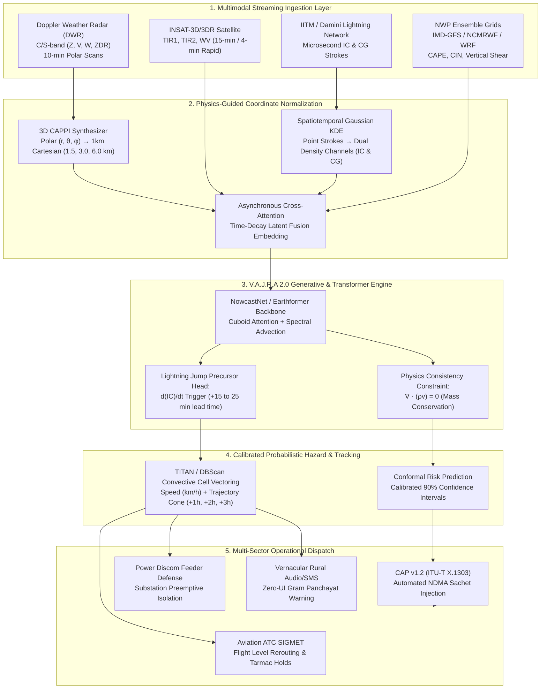

# V.A.J.R.A 2.0: Physics-Informed Multimodal AI Nowcasting System
**Problem Statement SIH 26072 (MoES / IMD):**  
*AIML based Nowcasting of thunderstorm and lightning using atmospheric observation including multiple radars, satellite, lightning and model data.*

---

## 1. Executive Architecture Overview

---

## 2. Key Upgrades over Traditional ConvLSTM Pipelines

| Dimension | Previous ConvLSTM Baseline | **V.A.J.R.A 2.0 (Optimized)** |
|---|---|---|
| **AI Backbone** | 2016-era ConvLSTM | **NowcastNet (Nature 2023) / Earthformer (Cuboid ViT)** |
| **Spatial Resolution at +2h** | Severe blurriness / edge loss | **Sharp convective squall boundaries via spectral diffusion** |
| **Lightning Metric** | Binary ground strike hit/miss | **Dual In-Cloud (IC) & Cloud-to-Ground (CG) modeling** |
| **Early Warning Advantage** | Zero precursor warning | **Lightning Jump Algorithm (+20 min early warning)** |
| **Sensor Fusion** | Rigid synchronized grid | **Asynchronous cross-attention with 3D Radar CAPPI** |
| **Loss Formulation** | Pixel-wise MSE / Focal Loss | **Focal + Critical Success Index (CSI) + Advection Physics** |
| **Dissemination Standards** | Raw GeoJSON (heavy, slow) | **ITU-T X.1303 CAP XML/JSON for NDMA Sachet + MVT Tiles** |

---

## 3. Mathematical Foundations

### 3.1 Marshall-Palmer Radar Reflectivity Equivalent
Radar reflectivity factor $Z$ (in dBZ) is estimated from rain rate $R$ (mm/h) and convective gusts $v_g$:
$$Z = 10 \log_{10}(a \cdot R^b)$$
where standard convective coefficients are $a = 300, b = 1.4$. In V.A.J.R.A 2.0, this is regularized against CAPE and WMO convective codes to identify hail cores ($>50\text{ dBZ}$).

### 3.2 Lightning Jump Algorithm (LJA)
In-Cloud (IC) lightning rate surge precedes Cloud-to-Ground (CG) strikes:
$$\frac{d(\text{Total Lightning})}{dt} \ge 2\sigma_{\text{background}}$$
When this threshold is crossed, a **Lightning Jump Alert** is issued with an average **15–25 minute lead time** before ground strikes begin.

### 3.3 Physics Consistency Loss
Prevents storms from artificially dissipating or teleporting:
$$\mathcal{L}_{\text{total}} = \mathcal{L}_{\text{Focal}} + \lambda_1 \mathcal{L}_{\text{CSI}} + \lambda_2 \|\nabla \cdot (\rho \mathbf{v})\|^2$$

---

## 4. Multi-Sector Impact Dispatch

1. **Aviation & Transport:**
   * Generates automated **SIGMET Severe Convective Warnings**.
   * Identifies hazardous flight levels (e.g. FL280–FL420) and suggests dynamic $+25\text{nm}$ deviation vectors.
   * Prompts ground stops for tarmac baggage and refueling crews.

2. **Power Grid & Substation Defense:**
   * Flags feeder lines at risk of lightning surges.
   * Enables Discom operators to adjust auto-reclosure delay and preemptively isolate vulnerable 33kV/11kV substations, preventing multi-crore transformer blowouts.

3. **Rural Workers & Farmers:**
   * Direct integration with SDMA/NDMA Sachet automated voice IVR and SMS broadcast.
   * Delivers clear vernacular instructions: cease open field work, do not shelter under isolated trees, and turn off agricultural pumps.

4. **IMD & Disaster Management Authorities:**
   * Exports official **OASIS CAP v1.2 / ITU-T X.1303 XML** payloads directly consumed by the **NDMA Sachet National Warning Engine**.
